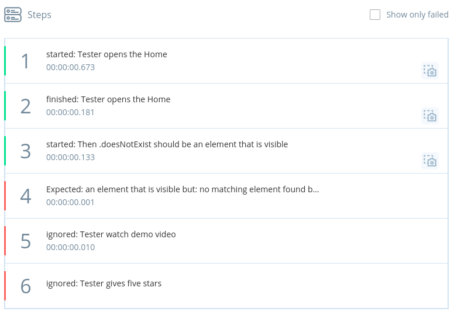

# testproject.io and serenity bdd

⚠️ Don't get your hopes up, does not work this way

using Serenity BDD with a custom driver implementation does work better

## how I think it should work

Get some screenplay into your testproject.io tests and reports.

follow https://docs.testproject.io/testproject-sdk/opensdk-v2/java-sdk to set up your agent and don't forget the `TP_DEV_TOKEN` environment variable.

check out this project and import it as maven project into your IDE.

run tests from the IDE.

run tests with `mvn verify`

## why?

Get some test code structure and readability by using `Actor`, `Performable` and `Question`. Get reports that provide context why you are asserting stuff, not just a list of driver commands.

## Thoughts and WTFs

* step reporting rather limited, `ReportingDriver` allows only status `passed` or `failed`
* automated command reporting gets pretty verbose, collapsing sub-steps like it's possible with these reports from recorded tests and sub-tests would be good
* error reporting in `@Nested` does not work
* testproject.io artifact upload limit of 50mb isn't enough . can i get rid of serenity-core and only pull in what I need?
* running a single class is fine, running all classes somehow results in `driver.sessionId == null` when calling `driver.report().step()`, weird.
* running multiple tests also results in `driver.sessionId == null` though less frequent 
* can't run things locally with surefire or failsafe. i think TestNg is messing with it?
